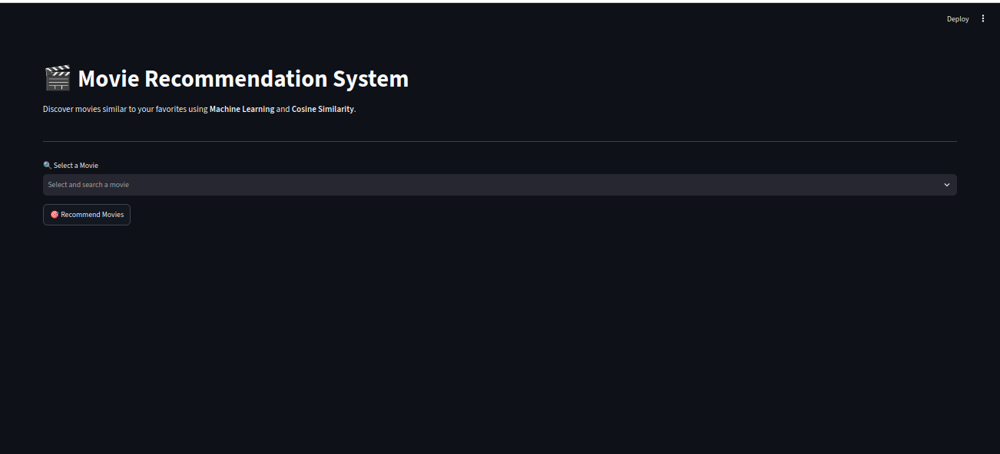
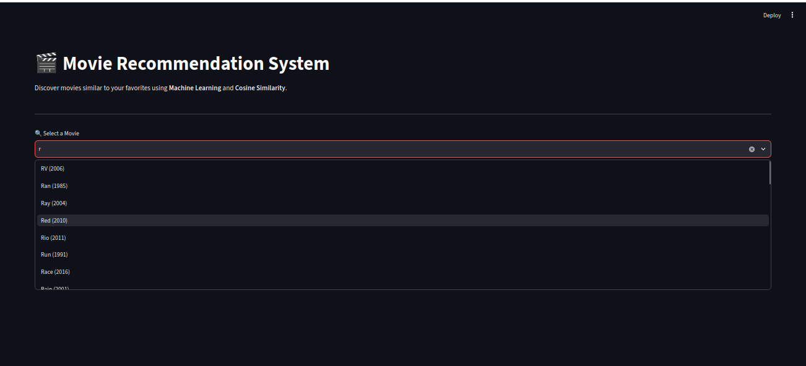
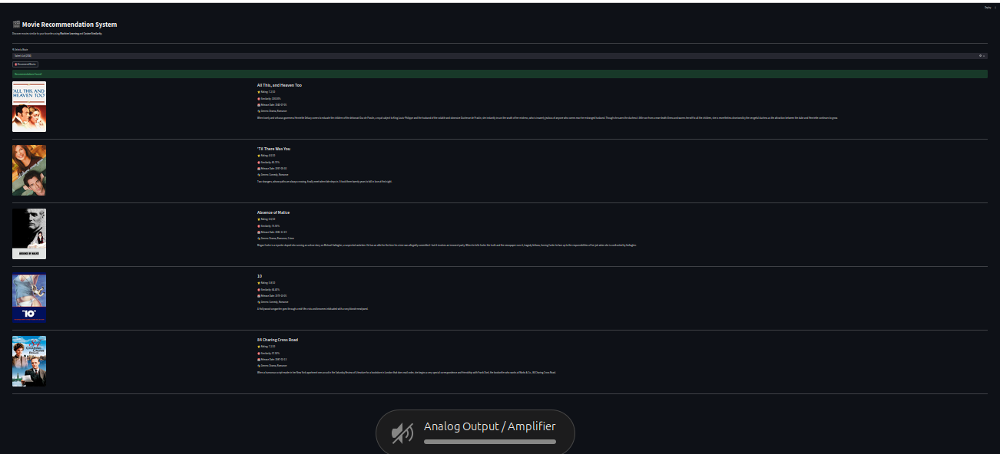
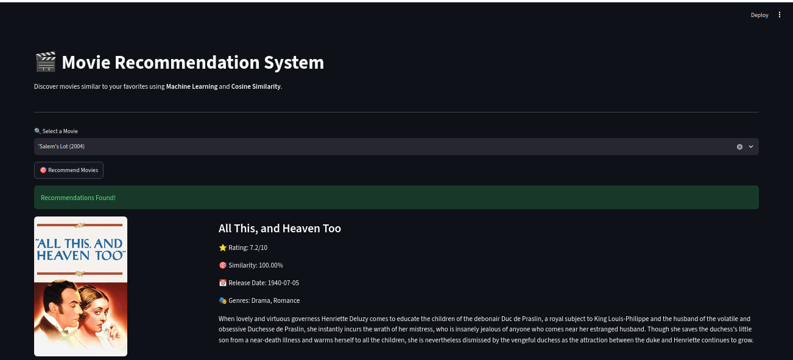

# 🎬 Movie Recommendation System

A Movie Recommendation System built using **Python**, **Streamlit**, **Pandas**, and **Scikit-learn**.

This project uses **Item-Based Collaborative Filtering** with **Cosine Similarity** to recommend movies similar to a selected movie. It integrates the **TMDB API** to display movie posters, ratings, genres, release dates, and overviews.

---

## ✨ Features

- 🎬 Item-Based Collaborative Filtering
- 🤖 Cosine Similarity-based Recommendations
- 🔍 Searchable Movie Selection
- 🖼️ Movie Posters using TMDB API
- ⭐ Movie Ratings
- 📅 Release Dates
- 🎭 Genres
- 📝 Movie Overview
- ⏳ Loading Spinner
- ⚠️ Error Handling for API Requests

---

## 🛠️ Tech Stack

- Python
- Streamlit
- Pandas
- Scikit-learn
- Joblib
- Requests
- TMDB API
- Python-dotenv

---

## 📂 Project Structure

```text
Movie-Recommendation-System/
│
├── app.py
├── recommender.py
├── tmdb.py
├── train.py
├── README.md
├── requirements.txt
├── .gitignore
│
├── data/
│   ├── movies.csv
│   ├── ratings.csv
│   ├── tags.csv
│   ├── links.csv
│   └── README.txt
│
├── models/
│   ├── movie_matrix.joblib
│   └── similarity.joblib
│
└── screenshots/
    ├── home.png
    ├── search.png
    ├── recommendations.png
    └── recommendations2.png
```

---

## 📊 Dataset

This project uses the **MovieLens Dataset** for building the recommendation model.

The **TMDB API** is used to fetch:

- Movie Posters
- Movie Ratings
- Genres
- Release Dates
- Movie Overview

---

## 🚀 Installation

Clone the repository

```bash
git clone https://github.com/YOUR_GITHUB_USERNAME/Movie-Recommendation-System.git
```

Go to the project directory

```bash
cd Movie-Recommendation-System
```

Install the required dependencies

```bash
pip install -r requirements.txt
```

Create a `.env` file

```text
TMDB_API_KEY=YOUR_API_KEY
```

Generate the recommendation model (if the model files are not included)

```bash
python train.py
```

Run the application

```bash
streamlit run app.py
```

---

## 📸 Screenshots

### 🏠 Home Page



---

### 🔍 Search Movie



---

### 🎬 Recommendation Results



---

### ⭐ More Recommendations



---

## 🔮 Future Improvements

- Genre-Based Filtering
- Popular Movie Recommendations
- Top Rated Movies
- Better Search Suggestions
- Hybrid Recommendation System
- Deployment on Streamlit Community Cloud

---

## 👨‍💻 Author

**Aryan Tiwari**

B.Tech in Computer Science and Engineering

IIIT Manipur

---

## 📜 License

This project is created for educational and learning purposes.
